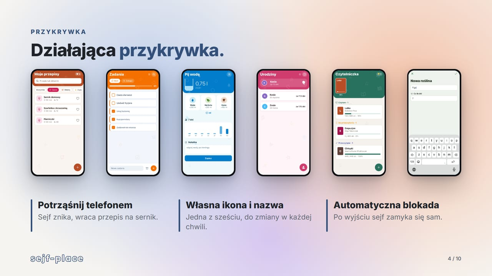
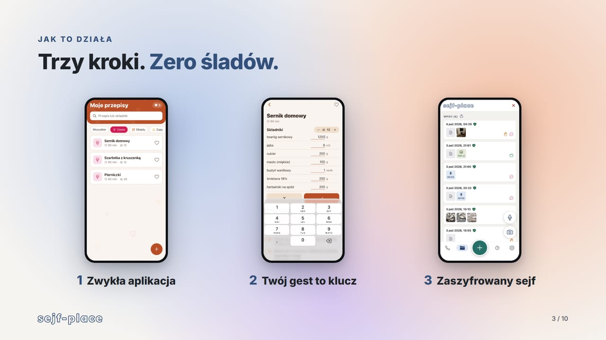

# sejf-place

## Note: The app, interface and documentation are in Polish.

**Evidence the abuser won't find, delete or discredit.**

sejf-place is a mobile app for documenting domestic violence, with a focus on economic abuse. The evidence vault is hidden inside a fully working everyday app. Developed by team **Mikformatycy** during **HackYeah 2026** for the *ImpactHer: Technology for Real Change* task.

[Demo video](https://www.youtube.com/watch?v=sMfchrRRX7c) · [Presentation (PDF)](docs/sejf-place-prezentacja.pdf)

## HackYeah 2026: 2nd Place

sejf-place took **2nd place** in the *ImpactHer: Technology for Real Change* task.

| Idea & Innovation | Relation to Category | Practical Applicability / Usability | Design | Completeness & Implementation Value | Average |
|:-:|:-:|:-:|:-:|:-:|:-:|
| 9.33 | 9.50 | 8.83 | 9.00 | 9.17 | **9.18** |

## Authors
Team Mikformatycy:
- Karolina Glaza (Team Lead) [GitHub](https://github.com/kequel)
- Jan Bancerewicz [GitHub](https://github.com/JanBancerewicz)
- Piotr Uszyński [GitHub](https://github.com/pierdziadek)
- Maciej Rapicki [GitHub](https://github.com/mrtakethatrrsk)
- Franciszek Fabiński [GitHub](https://github.com/fist-it)


## Problem
Since 22 June 2023, Polish law explicitly recognises economic abuse as domestic violence (Act on Counteracting Domestic Violence, art. 2(1)(1)(d)), yet it remains one of the hardest forms to prove:
- the abuser often controls the victim's phone: goes through the gallery, folders and "hidden photo" apps,
- evidence gets deleted, or dismissed as "made up" or "edited",
- when reporting (Poland's Blue Card procedure), what matters are dates, amounts and repetition: details nobody remembers months later.

In the EU, 1 in 5 women has experienced economic violence from a partner, and only 6.1% report a partner's physical or sexual violence to the police (Eurostat / FRA / EIGE, 2024).

## Key Features
1. **Six working cover apps**: recipes, to-do list, water tracker, birthdays, reading log and plant care. Each one is a real, usable app. The launcher icon (and on Android also the name) can be switched at any time.
2. **Action-based key**: there is no PIN screen, so there is nothing to look for. The vault opens only with an action the user recorded, e.g. changing the amount of quark in a cheesecake recipe to 1250 g.
3. **Encrypted vault**: entries with date, description, type of violence (categories from the Blue Card form) and amounts of money for economic abuse. Photos, audio recordings, gallery images and any files are encrypted (AES-256-GCM) and never land in the phone's gallery.
4. **Trusted timestamps**: every entry gets an RFC 3161 timestamp from an independent server and joins a SHA-256 hash chain. Edits create new versions instead of overwriting, so the history stays.
5. **PDF report**: a chronology of events for the Blue Card conversation with the police or a social worker: dates, descriptions, attachments, timestamps and money totals per category.
6. **ZIP evidence package**: anyone can verify it in a browser. Changing a single word flags the modified entry.
7. **"What the law says" (offline)**: rule-based matching of verified Polish legal provisions to the entry, together with what can be done right now.
8. **Voice of reason (AI, on request)**: Google Gemini assesses how serious the incident is. Hard safety rules cannot be overridden by the model (strangulation, a threat to kill or a weapon always mean the highest level). "Tidy up" fixes spelling without adding facts, and the original description stays.
9. **Quick exit**: tap X or shake the phone and the cheesecake recipe is back. The vault also locks automatically, and helpline numbers are always one tap away.



## How It Works


- **Key**: action in the cover -> canonical string -> `scrypt` -> device key (Android Keystore / iOS Keychain) → HKDF → unwraps the master key. All data is encrypted with AES-256-GCM.
- **Integrity**: each entry is canonical JSON hashed with SHA-256 together with the hash of the previous entry. Entries are append-only: an edit is a correction, a deletion leaves a tombstone.
- **Privacy**: without the user's action only SHA-256 hashes leave the phone (to the timestamp server). An entry's description goes to the AI only after the AI button is pressed, with names replaced by `[osoba A]`.

More details (in Polish): [architecture](docs/architektura.md), [threat model](docs/model-zagrozen.md), [legal research](docs/research-prawny.md), [demo script](docs/pitch-i-demo.md).

## Repository Structure
```
/
├── app/          - screens (expo-router): onboarding and vault
├── src/
│   ├── covers/     - six cover apps, action-based key detection
│   ├── vault/      - encrypted storage, keys, session, quick exit
│   ├── crypto/     - AES-GCM provider (Expo, Node for tests)
│   ├── integrity/  - SHA-256 chain, RFC 3161, CMS signatures, package verification
│   ├── report/     - PDF report and ZIP evidence package
│   ├── legal/      - offline legal hints and severity rules
│   ├── ai/         - Gemini client, prompts, pseudonymisation
│   └── __tests__/  - Jest test suite
├── verifier/     - standalone browser verifier with demo packages
├── modules/      - native module switching the cover icon
├── plugins/      - config plugin with the six launcher identities
├── server/       - AI proxy prototype 
├── scripts/      - icon generation, smoke tests, verifier build
└── docs/         - architecture, threat model, legal research, presentation
```

## Technologies Used
- Expo SDK 57, React Native, TypeScript, expo-router, zustand
- expo-crypto (AES-256-GCM), `@noble/hashes` (scrypt, HKDF, HMAC), expo-secure-store (Keystore / Keychain)
- `asn1js`, `pkijs` (RFC 3161, CMS)
- expo-print (PDF), `fflate` (ZIP)
- Google Gemini API (`gemini-3.5-flash`, fallback `gemini-3.5-flash-lite`)
- FreeTSA (RFC 3161 timestamps)
- Jest (101 automated tests)


## First Launch
1. Pick a cover app.
2. Record your key action.
3. Repeat that action any time to open the vault. Tap X or shake the phone to hide it again.

## Resources and AI Disclosure
As required by HackYeah rules, we disclose the external models, APIs, libraries and AI tools we used.

- **AI tools used to build the project**: Claude Code (Anthropic) for help with programming, debugging, UI design and documentation. The team is responsible for the whole solution and understands how it works.
- **Models and services in the app**: Google Gemini API for the optional assessment and tidy-up. Under the Gemini API terms (28.04.2026), content from the EEA is not used to improve Google services, including the free tier. FreeTSA for RFC 3161 timestamps.
- **Libraries**: Expo SDK 57 with Expo modules, React Native, expo-router, `@noble/hashes`, `fflate`, `zustand`, `@react-native-community/datetimepicker`, `@react-native-async-storage/async-storage`, Ionicons via `@expo/vector-icons` (MIT); `asn1js`, `pkijs` (BSD-3-Clause). Cover icons are our own SVGs rendered with `sharp` (Apache-2.0). Logo font: Lexend (SIL Open Font License 1.1).
- **Legal content and helplines**: legal acts and official websites, sources listed in [docs/research-prawny.md](docs/research-prawny.md).
- **Demo video and presentation**: Remotion (with Claude Code), Mixkit (music, sound effects and footage, Mixkit Free License), ElevenLabs voice-over (`eleven_multilingual_v2`). Statistics: Eurostat / FRA / EIGE, *EU gender-based violence survey* (2024); UN Women and UNODC, *Femicides in 2023* (2024).

All code was written during HackYeah 2026 (3–4 October 2026); apart from open-source libraries.
