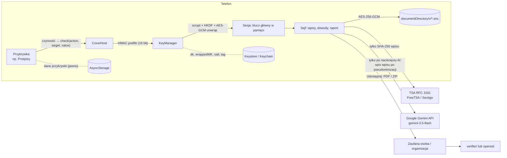

# Architektura

## Klucz = czynność w przykrywce

- Każda przykrywka zgłasza zdarzenia przez `check(action, value, target?)` (`src/covers/ui/shared.ts`).
- `canonicalize()` (`src/covers/canonical.ts`) buduje napis `przykrywka|czynność|cel|wartość`:
  - frazy: małe litery, bez polskich znaków, pojedyncze spacje,
  - liczby: bez zer wiodących.
- `KeyManager` (`src/vault/keys.ts`):
  - `prefilter()`: HMAC-SHA256(dk, kandydat), pierwsze 16 bitów porównywane z zapisanym tagiem, w mikrosekundach,
  - `tryUnlock()`: `KEK = HKDF(scrypt(kandydat, salt, N=2^11, r=8, p=1) ‖ dk)`, potem AES-GCM unwrap klucza głównego (AAD `przybornik/mk/v1`),
  - `setSecret()`: zmiana klucza to ponowne opakowanie klucza głównego. Dane nie są przeszyfrowywane.
- Gdy klucz pasuje, przykrywka **odrzuca** zmianę (np. nie zapisuje nowej ilości twarogu). `KeyRecorder` (`src/screens/KeyRecorder.tsx`) nagrywa klucz w prawdziwej przykrywce dwa razy.

## Magazyn

- `VaultStore` (`src/vault/store.ts`):
  - `index.enc` (JSON wpisów, ustawień, profilu, tokenów TSA) i `b_<id>.enc` (pliki),
  - każdy plik zaszyfrowany AES-256-GCM z losowym IV, AAD z identyfikatorem,
  - zapis atomowy przez plik `.tmp`,
  - `draft.enc`: niezapisany wpis (tekst i lista załączników), zaszyfrowany kluczem głównym z AAD `przybornik/draft/v1`. Zapisywany 0,8 s po każdej zmianie i natychmiast przy blokadzie (na kopii klucza), odtwarzany przy odblokowaniu. Jego załączniki są wyłączone ze sprzątania nieużywanych plików. Szkic, który okazuje się już zapisanym wpisem, jest odrzucany.
- Odszyfrowane pliki (podgląd zdjęcia, odtwarzacz, udostępnianie) trafiają do prywatnego `cache/tmp-x/`. Podgląd usuwa swój plik po zamknięciu wpisu, a cały katalog jest kasowany przy każdej blokadzie i starcie. Wcześniej obrazy szły przez data URI (base64 w JS), co dla zdjęcia z aparatu trwało kilka sekund.
- Przy blokadzie i starcie kasowane są też jawne kopie, które zostawiają biblioteki expo: `cache/Camera`, `cache/Audio`, `cache/ImagePicker`, `cache/DocumentPicker` (np. nagranie przerwane szybkim wyjściem).
- Zapisy indeksu (`useSession.update`) idą po kolei, w kolejce. Dwa nakładające się zapisy (nowy wpis i znaczniki czasu w tle) gubiły wcześniej jedną ze zmian.
- Szyfrowanie: `expo-crypto` (AES-GCM natywnie, SDK 57). KDF/HMAC: `@noble/hashes`. W testach ten sam interfejs `CryptoProvider` realizuje WebCrypto z Node.

## Integralność

- `entryRecord = {v, id, seq, createdAt, prevHash, content}` → kanoniczny JSON (JCS) → SHA-256 (`src/integrity/chain.ts`). Pierwszy wpis ma `prevHash = 0…0`.
- Wpisy są tylko dopisywane. „Edytuj” w interfejsie tworzy nowy wpis z `correctionOf`; lista pokazuje tylko najnowszą wersję, a widok wpisu ma historię wszystkich wersji. Usunięcie treści to `tombstone` (hash zostaje).
- RFC 3161 (`src/integrity/rfc3161.ts`):
  - `TimeStampReq` kodowany ręcznie w DER (sha256, nonce 64-bit, certReq), zgodność sprawdzona przez `openssl ts -query`,
  - odpowiedź parsowana przez `asn1js` z kontrolą imprint i nonce,
  - token zapisany w całości.
- Podpis CMS sprawdza `src/integrity/signature.ts` (pkijs) w weryfikatorze i testach. Tę samą weryfikację robi `openssl ts -verify`.

## Raport i pakiet

- `buildReportModel()` (`src/report/model.ts`): grupowanie według sekcji IV NK-A i chronologia jak w NK-C (pierwszy, powtarzające się, ostatni). Nic nie jest wnioskowane. Zatwierdzone teksty AI trafiają do raportu obok oryginałów.
- `renderReportHtml()`: HTML do `expo-print`. Opisy są cytowane dosłownie (z escapowaniem).
- `buildManifest()` + `buildZip()`: manifest.json, dowody/, tsr/, certs/, WERYFIKACJA.txt. PDF dostaje własny znacznik czasu.
- `computeMetrics()` (`src/report/metrics.ts`): liczby do pilotażu w polu `metrics` manifestu (wpisy, wpisy z plikami, dni od pierwszego zdarzenia i od pierwszego wpisu do raportu, wcześniejsze eksporty). Wyliczane z wpisów; aplikacja niczego nie śledzi ani nie wysyła. Nie są częścią łańcucha dowodowego.
- `verifyPackage()` (`src/integrity/verify.ts`) to wspólny kod aplikacji, testów i `verifier/`.

## AI (Google Gemini, prosto z telefonu)

- `src/ai/gemini.ts`: jedno wywołanie `generateContent` z `responseJsonSchema`; przy 5xx/429 jedno ponowienie na modelu zapasowym (`gemini-3.5-flash` → `gemini-3.5-flash-lite`, `src/ai/config.ts`). Klucz z `.env.local` (`EXPO_PUBLIC_GEMINI_API_KEY`).
- `makePseudonymizer()`: zamiana dokładnie wymienionych form imion (Ustawienia → „Ukryj imiona”) na `[osoba A]` przed wysłaniem i z powrotem po odpowiedzi.
- **Głos rozsądku** (`src/ai/assessEntry.ts`, prompt `ASSESS_*` w `src/ai/prompts.ts`): poziom `brak / niepokojace / powazne / zagrozenie`. `combineAssessment()` (`src/legal/assessment.ts`) łączy go z regułami offline (`src/legal/severity.ts`): model nie może dać niższego poziomu niż twarde sygnały (duszenie, groźba zabicia, broń, przemoc seksualna). Sama przemoc ekonomiczna to poziom „niepokojące”, chyba że towarzyszą jej groźby lub przemoc fizyczna.
- **Uporządkuj** (`REWRITE_*`): poprawia pisownię i zdania jednego opisu, bez dopisywania faktów. Wynik z liczbą, której nie ma w oryginale (`numbersIn()` z `src/ai/validate.ts`), jest odrzucany. Wersja AI jest zapisywana osobno (`aiSummary`), oryginał się nie zmienia.
- **Co mówi prawo** (`src/legal/`): reguły offline dopasowujące opis do sprawdzonych przepisów; nic nie jest wysyłane.
- Katalog `server/` to szkic serwera pośredniego z wcześniejszej wersji (nieużywany w aplikacji). W produkcji klucz AI powinien zostać na takim serwerze, a nie w aplikacji.

## Interfejs

- Paleta `C` (`src/ui/theme.ts`) jest podmieniana w miejscu przy zmianie trybu jasny/ciemny; style tworzone przez `themed()` przeliczają się przy następnym użyciu, a stos ekranów sejfu jest odtwarzany z nowym kluczem.
- Główne ekrany sejfu to zakładki (`app/sejf/(tabs)/`) ze wspólną dolną belką `BarShell` (`src/ui/BottomBar.tsx`); ta sama belka z kołem „głos rozsądku” jest w widoku wpisu.
- Animacja po otwarciu sejfu (`src/ui/UnlockIntro.tsx`) używa tylko transformacji i przezroczystości (native driver), pokazuje się wyłącznie po kluczu.
- Przykrywki (`src/covers/ui/`) mają kolorowe nagłówki `Hero` i delikatne tła `Backdrop` (`src/covers/ui/decor.tsx`); każde sprawdzenie klucza (`check()`) zostało bez zmian.

## Przykrywki natywnie

- `plugins/with-cover-aliases.js`: Android dostaje 6× `<activity-alias>` z etykietą i ikoną adaptacyjną, a MainActivity traci LAUNCHER. iOS dostaje `CFBundleAlternateIcons`.
- `modules/cover-switcher` (Kotlin: `setComponentEnabledSetting` z `DONT_KILL_APP`; Swift: `setAlternateIconName`). Zmiana jest stosowana przy wyjściu z sejfu.
- W Expo Go moduł nie istnieje (`requireOptionalNativeModule` zwraca `null`), więc funkcja jest ukryta.
