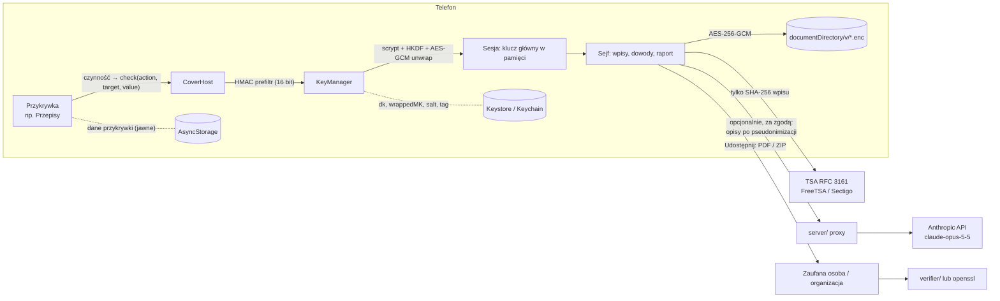

# Architektura

## Klucz = czynność w przykrywce

- Każda przykrywka zgłasza zdarzenia przez `check(action, value, target?)` (`src/covers/ui/shared.ts`).
- `canonicalize()` (`src/covers/canonical.ts`) buduje napis `przykrywka|czynność|cel|wartość`:
  - frazy: małe litery, bez polskich znaków, pojedyncze spacje,
  - liczby: bez zer wiodących.
- `KeyManager` (`src/vault/keys.ts`):
  - `prefilter()`: HMAC-SHA256(dk, kandydat), pierwsze 16 bitów porównywane z zapisanym tagiem, w mikrosekundach,
  - `tryUnlock()`: `KEK = HKDF(scrypt(kandydat, salt, N=2^11, r=8, p=1) ‖ dk)`, potem AES-GCM unwrap klucza głównego (AAD `przybornik/mk/v1`),
  - `setSecret()`: zmiana klucza to ponowne opakowanie klucza głównego. Dane nie są przeszyfrowywane.
- Gdy klucz pasuje, przykrywka **odrzuca** zmianę (np. nie zapisuje nowej ilości twarogu). `KeyRecorder` (`src/screens/KeyRecorder.tsx`) nagrywa klucz w prawdziwej przykrywce dwa razy.

## Magazyn

- `VaultStore` (`src/vault/store.ts`):
  - `index.enc` (JSON wpisów, ustawień, profilu, tokenów TSA) i `b_<id>.enc` (pliki),
  - każdy plik zaszyfrowany AES-256-GCM z losowym IV, AAD z identyfikatorem,
  - zapis atomowy przez plik `.tmp`,
  - `draft.enc`: niezapisany wpis (tekst i lista załączników), zaszyfrowany kluczem głównym z AAD `przybornik/draft/v1`. Zapisywany 0,8 s po każdej zmianie i natychmiast przy blokadzie (na kopii klucza), odtwarzany przy odblokowaniu. Jego załączniki są wyłączone ze sprzątania nieużywanych plików. Szkic, który okazuje się już zapisanym wpisem, jest odrzucany.
- Odszyfrowane pliki (podgląd zdjęcia, odtwarzacz, udostępnianie) trafiają do prywatnego `cache/tmp-x/`. Podgląd usuwa swój plik po zamknięciu wpisu, a cały katalog jest kasowany przy każdej blokadzie i starcie. Wcześniej obrazy szły przez data URI (base64 w JS), co dla zdjęcia z aparatu trwało kilka sekund.
- Przy blokadzie i starcie kasowane są też jawne kopie, które zostawiają biblioteki expo: `cache/Camera`, `cache/Audio`, `cache/ImagePicker`, `cache/DocumentPicker` (np. nagranie przerwane szybkim wyjściem).
- Zapisy indeksu (`useSession.update`) idą po kolei, w kolejce. Dwa nakładające się zapisy (nowy wpis i znaczniki czasu w tle) gubiły wcześniej jedną ze zmian.
- Szyfrowanie: `expo-crypto` (AES-GCM natywnie, SDK 57). KDF/HMAC: `@noble/hashes`. W testach ten sam interfejs `CryptoProvider` realizuje WebCrypto z Node.

## Integralność

- `entryRecord = {v, id, seq, createdAt, prevHash, content}` → kanoniczny JSON (JCS) → SHA-256 (`src/integrity/chain.ts`). Pierwszy wpis ma `prevHash = 0…0`.
- Wpisy są tylko dopisywane. Korekta to nowy wpis z `correctionOf`, a usunięcie treści to `tombstone` (hash zostaje).
- RFC 3161 (`src/integrity/rfc3161.ts`):
  - `TimeStampReq` kodowany ręcznie w DER (sha256, nonce 64-bit, certReq), zgodność sprawdzona przez `openssl ts -query`,
  - odpowiedź parsowana przez `asn1js` z kontrolą imprint i nonce,
  - token zapisany w całości.
- Podpis CMS sprawdza `src/integrity/signature.ts` (pkijs) w weryfikatorze i testach. Tę samą weryfikację robi `openssl ts -verify`.

## Raport i pakiet

- `buildReportModel()` (`src/report/model.ts`): grupowanie według sekcji IV NK-A i NK-C (pierwszy, powtarzające się, najniebezpieczniejszy, ostatni). Nic nie jest wnioskowane: „pierwszy” i „najniebezpieczniejszy” oznacza użytkowniczka.
- `renderReportHtml()`: HTML do `expo-print`. Opisy są cytowane dosłownie (z escapowaniem).
- `buildManifest()` + `buildZip()`: manifest.json, dowody/, tsr/, certs/, WERYFIKACJA.txt. PDF dostaje własny znacznik czasu.
- `computeMetrics()` (`src/report/metrics.ts`): liczby do pilotażu w polu `metrics` manifestu (wpisy, wpisy z plikami, dni od pierwszego zdarzenia i od pierwszego wpisu do raportu, wcześniejsze eksporty). Wyliczane z wpisów; aplikacja niczego nie śledzi ani nie wysyła. Nie są częścią łańcucha dowodowego.
- `verifyPackage()` (`src/integrity/verify.ts`) to wspólny kod aplikacji, testów i `verifier/`.

## AI

- `makePseudonymizer()`: zamiana dokładnie wymienionych form imion na `[osoba A]`.
- `server/server.ts`:
  - `client.beta.messages.create` z `claude-opus-5-5`, `output_config.format` (JSON Schema) i `effort: high`,
  - `fallbacks: "default"` (beta `server-side-fallback-2026-07-01`) dla odmów,
  - token aplikacji, porównanie w stałym czasie, bez logowania treści.
- `checkItems()`: odwołania do istniejących wpisów, liczby i miesiące muszą wynikać z wpisów. Wszystko inne jest flagowane do decyzji użytkowniczki.

## Przykrywki natywnie

- `plugins/with-cover-aliases.js`: Android dostaje 6× `<activity-alias>` z etykietą i ikoną adaptacyjną, a MainActivity traci LAUNCHER. iOS dostaje `CFBundleAlternateIcons`.
- `modules/cover-switcher` (Kotlin: `setComponentEnabledSetting` z `DONT_KILL_APP`; Swift: `setAlternateIconName`). Zmiana jest stosowana przy wyjściu z sejfu.
- W Expo Go moduł nie istnieje (`requireOptionalNativeModule` zwraca `null`), więc funkcja jest ukryta.
